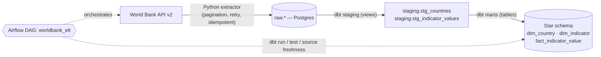

# World Bank ELT Pipeline

**🇪🇸 [Español](#-español) · 🇬🇧 [English](#-english)**

[](https://github.com/JuanAlvarezgh/worldbank-elt-pipeline/actions/workflows/ci.yml)



---

## 🇪🇸 Español

Pipeline **ELT** de extremo a extremo, totalmente reproducible, que ingiere indicadores
públicos de la [World Bank API v2](https://datahelpdesk.worldbank.org/knowledgebase/articles/889392),
los aterriza crudos en **PostgreSQL**, los transforma con **dbt** en un **esquema en estrella**
y lo orquesta todo con **Apache Airflow** — ejecutable con un solo `docker compose up`.

### 🛠️ Tecnologías
| Capa | Herramienta |
|---|---|
| Lenguajes | Python 3.11, SQL |
| Extracción | `requests` (cliente World Bank propio) |
| Carga | `psycopg` 3 → PostgreSQL 16 (upserts idempotentes `ON CONFLICT`) |
| Transformación | dbt 1.9 (`dbt-postgres`) + `dbt_utils` |
| Orquestación | Apache Airflow 2.9 (LocalExecutor) |
| Infraestructura | Docker Compose |
| Calidad | pytest, ruff, tests de dbt, source freshness |
| CI | GitHub Actions |

### ✅ Qué se hizo
- **Extractor en Python** con paginación, **backoff exponencial**, reintentos ante timeouts/5xx,
  manejo de payloads malformados y diseño idempotente — con tests unitarios (HTTP mockeado, sin red).
- **Loaders idempotentes** a Postgres (`ON CONFLICT ... DO UPDATE`) en un esquema `raw`.
- **Proyecto dbt**: vistas de staging + **star schema Kimball** (`dim_country`, `dim_indicator`,
  `fact_indicator_value`) con tests `unique`/`not_null`/`relationships`/`accepted_range` y source freshness.
- **DAG de Airflow** (`extract → load → dbt build → dbt test → source freshness`) con
  **reintentos a nivel de task** para tolerar la inestabilidad de la API pública.
- **CI en GitHub Actions**: ruff + pytest + dbt build contra un Postgres de servicio,
  sembrando un fixture determinista y verificando salida no vacía.

### 🤔 Por qué
- Demuestra el **"modern data stack"** que pide el mercado de Data Engineering (Airflow + dbt + cloud DW pattern).
- Combina **software** (un extractor testeado, con manejo de errores) con **ingeniería de datos**
  (orquestación, modelado dimensional, calidad de datos, CI) — el doble perfil DE + dev.
- **Reproducible para un reclutador**: clona y corre con un comando, sin cuentas cloud ni tarjetas.

### 📊 Resultados
- **Star schema poblado**: ~**51.000 filas** de hechos en `fact_indicator_value`, **217 países**, **8 indicadores** (1990–2023).
- **16 tests** (unitarios + integración) en verde · `ruff` limpio · `dbt build` **PASS=22**.
- **DAG verde de extremo a extremo** (los 5 tasks), incluso aguantando un corte transitorio real de la API vía reintentos.
- **CI verde** en GitHub Actions.

### 🚀 Cómo correrlo
```bash
cp .env.example .env
docker compose up -d            # warehouse-postgres + Airflow
# abre http://localhost:8080 (admin/admin), des-pausa y dispara el DAG `worldbank_elt`
docker compose exec warehouse-postgres psql -U warehouse -c "SELECT count(*) FROM marts.fact_indicator_value;"
```

> **Nota:** los tests de integración del loader hacen `TRUNCATE raw.*` para aislarse; tras correr
> `pytest` localmente, recarga con `python -m pipelines.run_el ...` o dispara el DAG antes de un `dbt build` completo.

---

## 🇬🇧 English

An end-to-end, fully reproducible **ELT pipeline** that ingests public indicators from the
[World Bank API v2](https://datahelpdesk.worldbank.org/knowledgebase/articles/889392), lands
them raw in **PostgreSQL**, transforms them with **dbt** into a **star schema**, and orchestrates
the whole flow with **Apache Airflow** — runnable with a single `docker compose up`.

### 🛠️ Technologies
| Layer | Tool |
|---|---|
| Languages | Python 3.11, SQL |
| Extract | `requests` (custom World Bank client) |
| Load | `psycopg` 3 → PostgreSQL 16 (idempotent `ON CONFLICT` upserts) |
| Transform | dbt 1.9 (`dbt-postgres`) + `dbt_utils` |
| Orchestration | Apache Airflow 2.9 (LocalExecutor) |
| Infra | Docker Compose |
| Quality | pytest, ruff, dbt tests, source freshness |
| CI | GitHub Actions |

### ✅ What was built
- A **Python extractor** with pagination, **exponential backoff**, retries on timeouts/5xx,
  malformed-payload guards and idempotent design — unit-tested with mocked HTTP (no network).
- **Idempotent Postgres loaders** (`ON CONFLICT ... DO UPDATE`) into a `raw` schema.
- A **dbt project**: staging views + **Kimball star schema** (`dim_country`, `dim_indicator`,
  `fact_indicator_value`) with `unique`/`not_null`/`relationships`/`accepted_range` tests and source freshness.
- An **Airflow DAG** (`extract → load → dbt build → dbt test → source freshness`) with
  **task-level retries** to tolerate the flaky public API.
- **GitHub Actions CI**: ruff + pytest + dbt build against a Postgres service, seeding a
  deterministic fixture and asserting non-empty output.

### 🤔 Why
- Showcases the **modern data stack** Data Engineering hiring asks for (Airflow + dbt + cloud-DW pattern).
- Pairs **software engineering** (a tested, error-handling extractor) with **data engineering**
  (orchestration, dimensional modeling, data quality, CI) — the dual DE + dev profile.
- **Reproducible for a recruiter**: clone and run with one command, no cloud accounts or cards.

### 📊 Results
- **Populated star schema**: ~**51,000** fact rows in `fact_indicator_value`, **217 countries**, **8 indicators** (1990–2023).
- **16 tests** (unit + integration) green · `ruff` clean · `dbt build` **PASS=22**.
- **Green DAG end-to-end** (all 5 tasks), riding out a real transient API outage via retries.
- **Green CI** on GitHub Actions.

### 🚀 How to run
```bash
cp .env.example .env
docker compose up -d            # warehouse-postgres + Airflow
# open http://localhost:8080 (admin/admin), unpause and trigger the `worldbank_elt` DAG
docker compose exec warehouse-postgres psql -U warehouse -c "SELECT count(*) FROM marts.fact_indicator_value;"
```

> **Note:** the loader integration tests `TRUNCATE raw.*` to isolate themselves; after running
> `pytest` locally, reload with `python -m pipelines.run_el ...` or trigger the DAG before a full `dbt build`.

---

### 🧠 Skills demonstrated / Habilidades demostradas
`SQL` · `Python` · `ETL/ELT` · `Apache Airflow` · `dbt` · `dimensional modeling` ·
`data quality & testing` · `Git / CI (GitHub Actions)` · `Docker`

### 🔭 Possible extensions / Extensiones posibles
- Parameterize the warehouse target for **BigQuery** / **Snowflake**.
- Swap the hand-rolled extractor for an EL tool (**dlt** / **Meltano**).
- Build a BI layer (Power BI / Tableau) on top of the marts.
