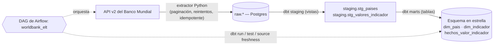

<div align="center">

# Pipeline ELT del Banco Mundial

**ELT de indicadores socioeconómicos: extracción en Python, modelo en estrella con dbt y orquestación con Airflow**

[](https://github.com/JuanAlvarezgh/worldbank-elt-pipeline/actions/workflows/ci.yml)


</div>

Pipeline de datos de extremo a extremo, reproducible con un solo `docker compose up`, que ingiere
indicadores socioeconómicos de la [API v2 del Banco Mundial](https://datahelpdesk.worldbank.org/knowledgebase/articles/889392),
los carga crudos en **PostgreSQL**, los transforma con **dbt** en un **esquema en estrella** y orquesta
todo el flujo con **Apache Airflow**.

## Objetivo

Demostrar, sobre un caso realista, el patrón "modern data stack" que pide el mercado de Data Engineering:
extracción robusta desde una API pública e inestable, carga idempotente, modelado dimensional con pruebas
de calidad y orquestación con reintentos. Todo verificable y "clona y corre", para que un reclutador pueda
levantar el proyecto y reproducir exactamente el resultado.

## Arquitectura



El flujo del DAG es: `extraer_cargar_paises → extraer_cargar_valores → dbt_build → dbt_test → dbt_source_freshness`.
La tabla de hechos tiene granularidad **país × indicador × año** y se une con un INNER JOIN a ambas
dimensiones, lo que descarta de forma intencional las geografías agregadas del Banco Mundial (regiones,
grupos de ingreso, "World") y mantiene la integridad referencial.

## Tecnologías

| Capa | Herramienta |
|---|---|
| Lenguajes | Python 3.11, SQL |
| Extracción | `requests` (cliente propio del Banco Mundial) |
| Carga | `psycopg` 3 → PostgreSQL 16 (upserts idempotentes `ON CONFLICT`) |
| Transformación | dbt 1.9 (`dbt-postgres`) + `dbt_utils` |
| Orquestación | Apache Airflow 2.9 (LocalExecutor) |
| Infraestructura | Docker Compose |
| Calidad | pytest, ruff, tests de dbt, source freshness |
| CI | GitHub Actions |

## Qué se construyó

- **Extractor en Python** con paginación de la API, **backoff exponencial** y reintentos ante timeouts,
  errores de conexión y códigos 429/5xx; manejo de payloads malformados; diseño idempotente. Probado con
  HTTP simulado (sin red).
- **Loaders idempotentes** a Postgres (`ON CONFLICT ... DO UPDATE`) sobre un esquema `raw`, de modo que
  re-ejecutar el pipeline nunca duplica filas.
- **Proyecto dbt**: vistas de `staging` + **esquema en estrella Kimball** (`dim_pais`, `dim_indicador`,
  `hechos_valor_indicador`) con tests `unique`, `not_null`, `relationships` y `accepted_range`, más
  `source freshness`. La dimensión de indicadores se sirve desde un `seed` curado.
- **DAG de Airflow** con **reintentos a nivel de tarea** (`retries=3`, backoff de 30 s) para tolerar la
  inestabilidad de la API pública, y `end_year` derivado de la fecha de ejecución para mantener los datos
  al día.
- **CI en GitHub Actions**: ruff + pytest + `dbt build` contra un Postgres de servicio, sembrando un
  fixture determinista y verificando que la tabla de hechos no quede vacía.

## Decisiones de diseño (el porqué)

- **Reintentos en dos niveles.** Durante el desarrollo, la API del Banco Mundial devolvía timeouts y 400
  esporádicos bajo carga. El extractor reintenta a nivel de petición (backoff exponencial) y el DAG
  reintenta a nivel de tarea; en una corrida real el pipeline aguantó una caída transitoria de la API y
  terminó en verde de extremo a extremo.
- **Carga idempotente (full upsert).** Permite backfills y reprocesos sin duplicar; la clave natural es
  `(codigo_indicador, pais_iso3, anio)`.
- **Estrella con INNER JOIN a dimensiones.** Garantiza integridad referencial y filtra agregados; los tests
  de `relationships` quedan siempre válidos.

## Resultados

- **Cobertura:** **217 países**, **8 indicadores** (PIB, PIB per cápita, población, esperanza de vida,
  desempleo, gasto en educación, acceso a electricidad, gasto en salud), años **1990–2025**, **51.280**
  filas de hechos.
- **Calidad:** **16 tests** (unitarios + integración) en verde, `ruff` limpio, `dbt build` **PASS=22**
  (modelos + tests), **CI verde** en GitHub Actions.
- **Robustez probada:** una ejecución del DAG sobrevivió a una ventana de fallos de la API gracias a los
  reintentos y terminó con los 5 pasos en verde.

## Hallazgos en los datos

Consultas de ejemplo en [`docs/consultas_ejemplo.sql`](docs/consultas_ejemplo.sql). Algunos resultados
reales del warehouse:

- **PIB per cápita (2020):** los líderes son micro-economías y centros financieros — **Mónaco
  (~US$176.892)**, Liechtenstein (~US$164.671), Luxemburgo (~US$116.860), Bermudas (~US$106.977) e
  Irlanda (~US$86.514) —, muy por encima de las grandes economías, lo que ilustra cómo el PIB per cápita
  premia a poblaciones pequeñas con alta renta.
- **Población por región (2022):** **Asia Oriental y el Pacífico (~2.356 M)** y **Asia del Sur (~1.648 M)**
  concentran más de la mitad de la población mundial; les siguen África Subsahariana (~1.229 M) y Europa
  y Asia Central (~924 M). Norteamérica (~373 M) es la región menos poblada del conjunto.
- La cobertura 1990–2025 permite analizar series largas (por ejemplo, la evolución de la esperanza de vida
  por país, incluido el efecto de la pandemia en 2020).

## Cómo correrlo

```bash
cp .env.example .env
docker compose up -d                 # warehouse + Airflow
# abre la interfaz de Airflow en http://localhost:8080, activa y dispara el DAG `worldbank_elt`
docker compose exec warehouse-postgres psql -U warehouse -c "select count(*) from marts.hechos_valor_indicador;"
```

Para desarrollo local sin Airflow: `python -m pipelines.run_el` carga los datos y luego
`cd dbt_worldbank && DBT_PROFILES_DIR=. dbt build` construye y prueba el modelo.

> Nota: los tests de integración del loader hacen `TRUNCATE raw.*` para aislarse; tras correr `pytest`
> localmente, recarga con `python -m pipelines.run_el` o dispara el DAG antes de un `dbt build` completo.

## Calidad y tests

- **Pruebas unitarias** del extractor (`tests/test_models.py`, `tests/test_client.py`): paginación,
  reintentos ante 429/5xx y timeouts, filtrado de agregados y de códigos ISO inválidos, payloads
  malformados y cierre de sesión vía context manager — todo con HTTP simulado.
- **Pruebas de integración** del loader (`tests/test_loader.py`): upserts idempotentes contra un Postgres
  real (se omiten si no hay `WAREHOUSE_DSN`).
- **Tests de dbt**: `unique`, `not_null`, `relationships` (claves foráneas), `accepted_range` (año 1960–2100)
  y `source freshness`.

## Estructura

```
worldbank-elt-pipeline/
├─ worldbank_extractor/     # cliente de la API + modelos de fila (extracción)
├─ load/                    # loaders idempotentes a raw (carga)
├─ pipelines/run_el.py      # punto de entrada extract+load y CLI
├─ dbt_worldbank/           # proyecto dbt: sources, staging, marts, seed, tests
├─ dags/worldbank_elt.py    # DAG de Airflow
├─ docker-compose.yml       # warehouse + Airflow
├─ .github/workflows/ci.yml # lint + tests + dbt build
└─ docs/                    # consultas de ejemplo
```

## Habilidades

SQL, Python, diseño de pipelines ETL/ELT, Apache Airflow, dbt, modelado dimensional (esquema en estrella),
calidad de datos y testing, Git / CI (GitHub Actions), Docker.

---

## Contacto

[](https://www.linkedin.com/in/juanalvarezgh)
[](mailto:juanalvarezghcode@gmail.com)
[](https://github.com/JuanAlvarezgh)
